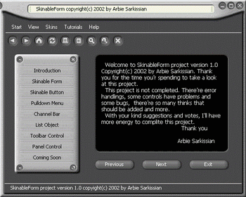



## SkinnableForm ver 2\.0 \(New features, 20 Skin, Some bugs fixed\)

### Description

Hi. This is second version of my SkinnableForm project with main changes. First I changed the way of skinning which was really boring. Now all skin settings are read from a .ini file and changing skin is very simple by chosing a new .ini file. Now you can chose between 20 different skins added to this version.

I added some features such as Resizing, System Menu, Easy TrayIcon and fixed some bugs. I also add a HTML Tutorial that explains how you can use this project to make your own project skinnable.

There's a new control called ctrl_ProgressBar, which I designed to fit with new environment, but I'm not contented, It needs more work.

unfortunatly I couldn't upload my code because of Script Time Out error so I put it in following link:

http://www.ea-networks.com/skinnableform/skinnableForm.zip

I hope you enjoy it. Thank you for all those who leaved me notes and told me their ideas about project. Sorry that I couldn't reply. I'm expecting any help for improving this code with open arms. Please feel free to send your ideas. Thank You.

Get the code from here:

http://www.ea-networks.com/skinnableform/skinnableForm.zip
 
### More Info
 

             |
---                |---
**Submitted On**   |2003-09-01 08:21:40
**By**             |[Arbie Sarkissian](https://github.com/Planet-Source-Code/PSCIndex/blob/master/ByAuthor/arbie-sarkissian.md)
**Level**          |Advanced
**User Rating**    |4.7 (128 globes from 27 users)
**Compatibility**  |VB 6\.0
**Category**       |[OLE/ COM/ DCOM/ Active\-X](https://github.com/Planet-Source-Code/PSCIndex/blob/master/ByCategory/ole-com-dcom-active-x__1-29.md)
**World**          |[Visual Basic](https://github.com/Planet-Source-Code/PSCIndex/blob/master/ByWorld/visual-basic.md)
**Archive File**   |[SkinnableF1652461012003\.zip](https://github.com/Planet-Source-Code/arbie-sarkissian-skinnableform-ver-2-0-new-features-20-skin-some-bugs-fixed__1-48927/archive/master.zip)

